# WRjouITE UP


# write up

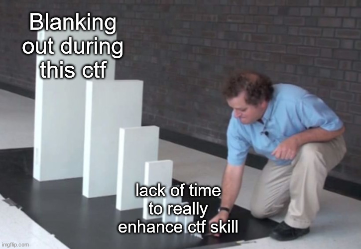

## ctfIsMagic

`katana`
`urxry_zhqn`
`!root`

# Table of Content
1. [Reverse Engineering](#reverse-engineering)
1.1 [Code Jugling](#code-jugling) 
2. [Forensic](#forensic)
2.1 [Traffic Enjoyer](#traffic-enjoyer)
2.2 [Har](#har)

# Reverse Engineering

# Code Jugling

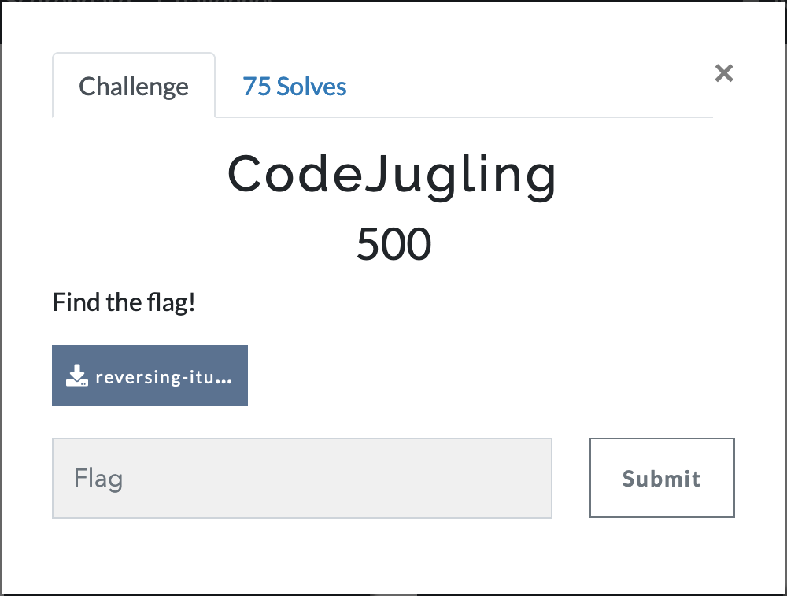

## Proof of Concept
Masukan file kedalam ghidra untuk diproses, lalu temukan main  function **“nama function main dipanggil sebagai parameter pertama pada function entry”.**

```jsx
undefined4 FUN_00401140(int param_1,undefined8 *param_2)

{
  size_t sVar1;
  uint local_20;
  int local_1c;
  
  if (param_1 == 2) {
    FUN_004014a0(param_2[1],0);
    FUN_004014e0(param_2[1],1);
    FUN_00401520(param_2[1],2);
    FUN_00401560(param_2[1],3);
    FUN_004015a0(param_2[1],4);
    FUN_004015e0(param_2[1],5);
    FUN_00401620(param_2[1],6);
    FUN_00401660(param_2[1],7);
    FUN_004016a0(param_2[1],8);
    FUN_004016e0(param_2[1],9);
    FUN_00401720(param_2[1],10);
    FUN_00401760(param_2[1],0xb);
    FUN_004017a0(param_2[1],0xc);
    FUN_004017e0(param_2[1],0xd);
    FUN_00401820(param_2[1],0xe);
    FUN_00401860(param_2[1],0xf);
    FUN_004018a0(param_2[1],0x10);
    FUN_004018e0(param_2[1],0x11);
    FUN_00401920(param_2[1],0x12);
    FUN_00401960(param_2[1],0x13);
    FUN_004019a0(param_2[1],0x14);
    FUN_004019e0(param_2[1],0x15);
    FUN_00401a20(param_2[1],0x16);
    FUN_00401a60(param_2[1],0x17);
    FUN_00401aa0(param_2[1],0x18);
    FUN_00401ae0(param_2[1],0x19);
    FUN_00401b20(param_2[1],0x1a);
    FUN_00401b60(param_2[1],0x1b);
    FUN_00401ba0(param_2[1],0x1c);
    FUN_00401be0(param_2[1],0x1d);
    FUN_00401c20(param_2[1],0x1e);
    FUN_00401c60(param_2[1],0x1f);
    FUN_00401ca0(param_2[1],0x20);
    FUN_00401ce0(param_2[1],0x21);
    FUN_00401d20(param_2[1],0x22);
    local_20 = 0;
    for (local_1c = 0; local_1c < 35; local_1c = local_1c + 1) {
      local_20 = *(uint *)(&DAT_00404050 + (long)local_1c * 4) | local_20;
    }
    sVar1 = strlen((char *)param_2[1]);
    if (sVar1 != 0x23) {
      local_20 = 1;
    }
    if (local_20 == 0) {
      printf("Congratulations, the flag is: %s\n",param_2[1]);
    }
    else {
      printf("Sorry, wrong flag\n");
    }
  }
  else {
    printf("Usage: %s flag\n",*param_2);
  }
  return 0;
}
```

Berfokus pada banyaknya fungsi 

```jsx
FUN_004014a0(param_2[1],0);
    FUN_004014e0(param_2[1],1);
    FUN_00401520(param_2[1],2);
    FUN_00401560(param_2[1],3);
    FUN_004015a0(param_2[1],4);
    FUN_004015e0(param_2[1],5);
    FUN_00401620(param_2[1],6);
    FUN_00401660(param_2[1],7);
    FUN_004016a0(param_2[1],8);
    FUN_004016e0(param_2[1],9);
    FUN_00401720(param_2[1],10);
    FUN_00401760(param_2[1],0xb);
    FUN_004017a0(param_2[1],0xc);
    FUN_004017e0(param_2[1],0xd);
    FUN_00401820(param_2[1],0xe);
    FUN_00401860(param_2[1],0xf);
    FUN_004018a0(param_2[1],0x10);
    FUN_004018e0(param_2[1],0x11);
    FUN_00401920(param_2[1],0x12);
    FUN_00401960(param_2[1],0x13);
    FUN_004019a0(param_2[1],0x14);
    FUN_004019e0(param_2[1],0x15);
    FUN_00401a20(param_2[1],0x16);
    FUN_00401a60(param_2[1],0x17);
    FUN_00401aa0(param_2[1],0x18);
    FUN_00401ae0(param_2[1],0x19);
    FUN_00401b20(param_2[1],0x1a);
    FUN_00401b60(param_2[1],0x1b);
    FUN_00401ba0(param_2[1],0x1c);
    FUN_00401be0(param_2[1],0x1d);
    FUN_00401c20(param_2[1],0x1e);
    FUN_00401c60(param_2[1],0x1f);
    FUN_00401ca0(param_2[1],0x20);
    FUN_00401ce0(param_2[1],0x21);
    FUN_00401d20(param_2[1],0x22);
```

Apabila setiap fungsi dibuka maka terdapat character yang dijadikan pembanding disana.

```jsx
void FUN_004014a0(long param_1,int param_2)

{
  *(uint *)(&DAT_00404050 + (long)param_2 * 4) = (uint)(*(char *)(param_1 + param_2) != 'G');
  return;
}
```

```jsx
x != 'G'
```

hal tersebut terdapat disemua fungsi sehingga charater tersebut membentuk sebuah flag.

```jsx
Gemastik2022{st45iUn_MLG_k07a_b4rU}
```

## Flag
Gemastik2022{st45iUn_MLG_k07a_b4rU}

# FORENSIC

# Traffic Enjoyer
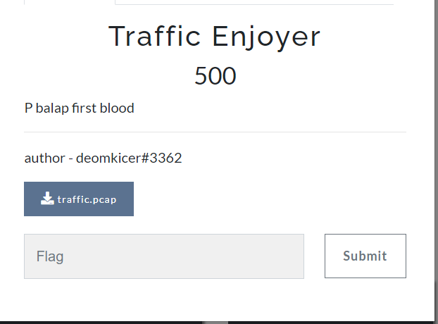

## Proof of Concept
Untuk soal Traffic Enjoyer diberikan sebuah file pcap yang berisikan traffic data. Disini kami menggunakan Wireshark untuk melihat data yang ada.
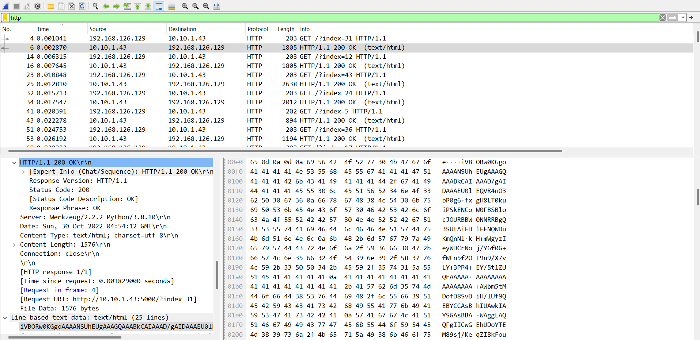
Di dalam nya terdapat banyak data yakni traffic TCP dan HTTP. Namun yang membuat kami tertarik di sini yaitu pada bagian HTTP, dimana terdapat banyak HTTP get .index dan hasil request nya html/text.

Setelah itu di sini kami mengexport object list HTTP request yang ada. 
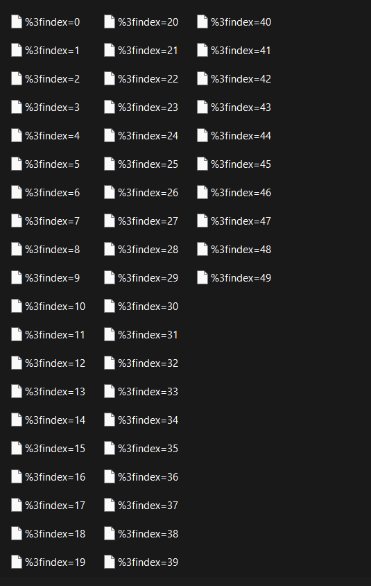
Setelah kami melihat data yang ada di dalam masing masing index, disni kami menyadari bahwa file yang ada berupa data yang berbentuk ***base64***. Selain itu terdapat ***ivBO*** di dalam nya membuat kami yakin bahwa data tersebut merupakan image file.

Setelah itu disni kami menggunakan tools online untuk mengubah data base64 yang ada menjadi image file menggunakan ***https://codebeautify.org/base64-to-image-converter***
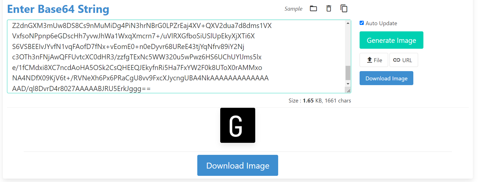
Setelah itu kami mendapatkan sebuah kata dari hasil convert tersebut. Kami melakukan hal yang sama untuk semua file index html yang ada ***%3findex=0 sampai %3findex=49***

## Flag
Gemastik2022{balapan_f1rst_bl00d_is_real_f580c176}

# Har
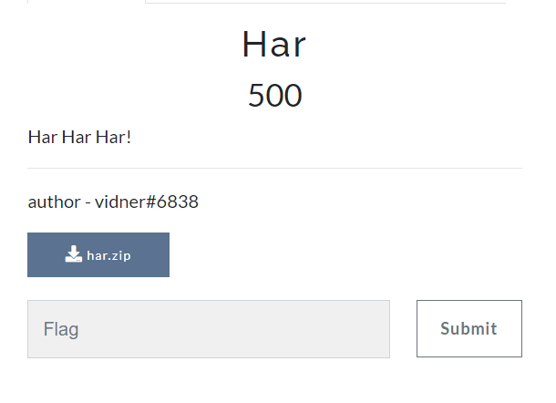
## Proof of Concept
Untuk soal har ini disana kami setelah searching mengenai apa itu file berformat har, nah disini kami mendapatkan tool ***https://toolbox.googleapps.com/apps/har_analyzer/*** untuk menganalisa file ***har** yang diberikan.
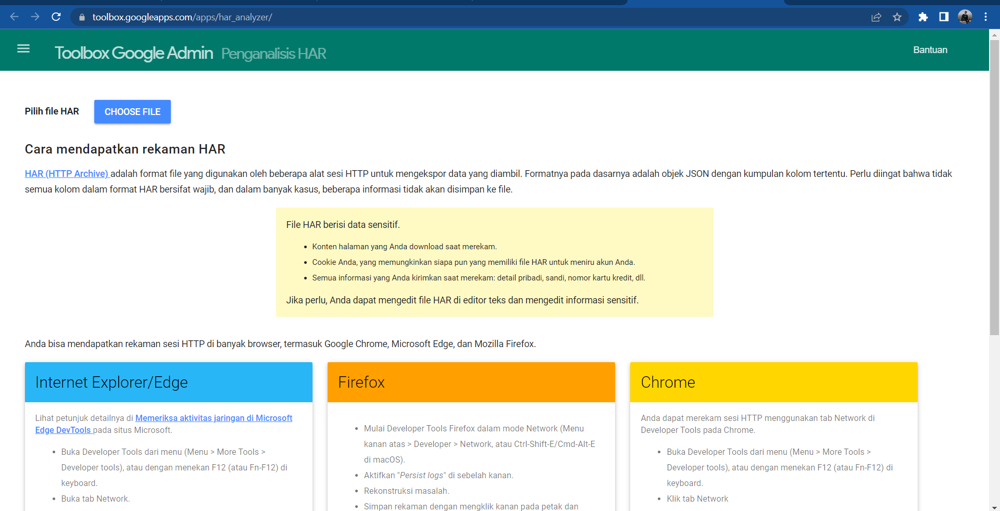
Dari analisa yang kami dapatkan terhadap data yang ada, di sana terdapat banyak traffic yang mengakses ke ***figma.com*** 
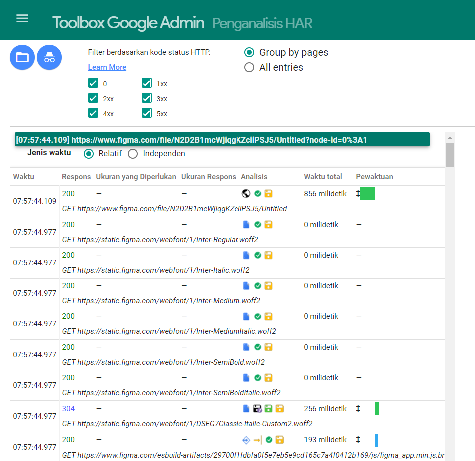
Setelah kami coba untuk mengakses salah satu method get yaitu ***https://www.figma.com/file/N2D2B1mcWjiqgKZciiPSJ5/Untitled*** kami menemukan sebuah figma project file yang mana di tidak dapat diakses. 
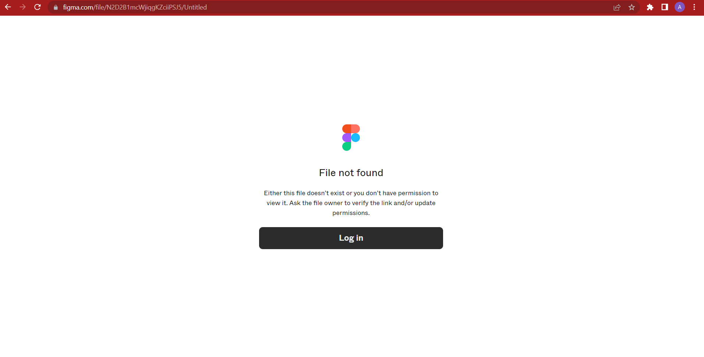
Nah setelah kami melihat melihat lagi terhadap proses yang ada dalam method request yang diberikan, ternyata di sana terdapat sebuah ***cookie***. Nah dari sana kami kepikiran untuk mencoba cookie tersebut untuk mengakses project figma yang ada.
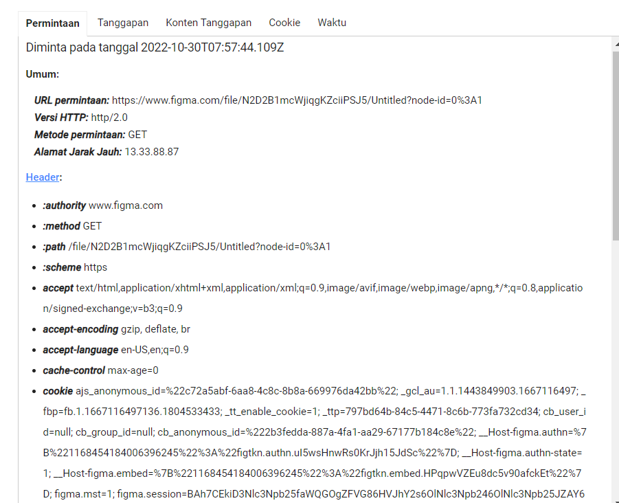
Nah berikut merupakan tampilan untuk melihat cookie yang ada menggunakan tools tersebut.
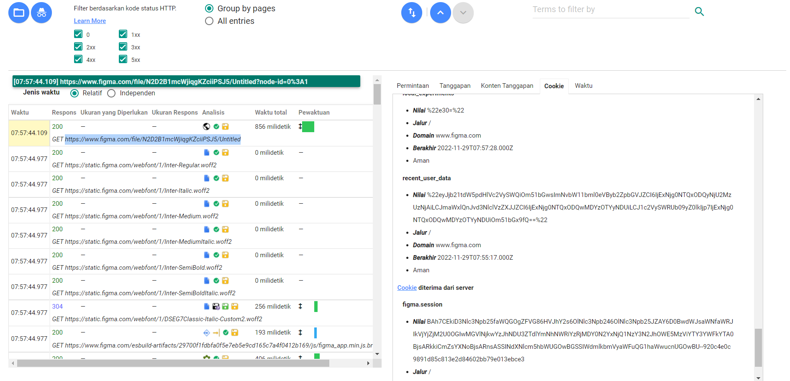
Nah kemudian disini kami mencoba untuk menambahkan value pada cookie di browser
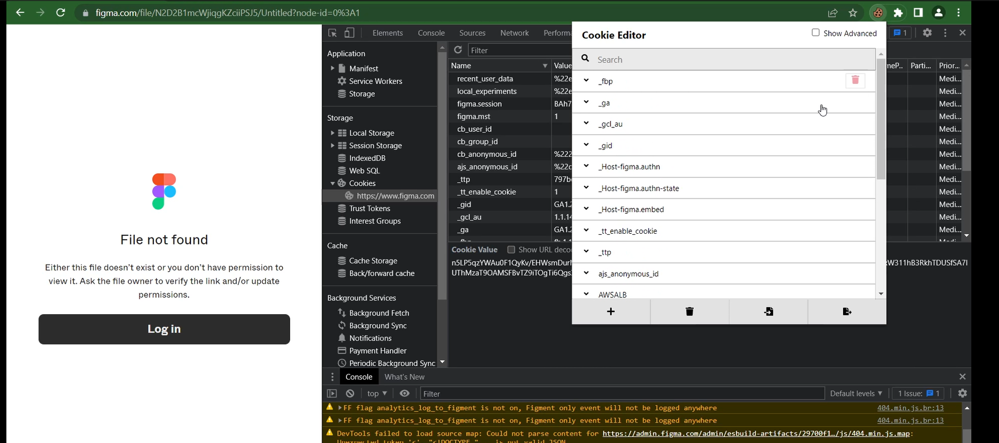

```
# Netscape HTTP Cookie File
# http://curl.haxx.se/rfc/cookie_spec.html
# This is a generated file!  Do not edit.

.www.figma.com	TRUE	/	TRUE	1669812062	ajs_anonymous_id	a87ae32b-28a6-4cd7-bdcd-0b0557e06652
www.figma.com	FALSE	/	TRUE	1669725662	ajs_anonymous_id	%22c189b04f-f3be-477c-b895-c878420027fd%22
www.figma.com	FALSE	/	TRUE	1669725663	experiment_seed	%22882556%22
www.figma.com	FALSE	/	TRUE	1669736351	local_experiments	%22e30=%22
.figma.com	TRUE	/	FALSE	1698670023	ajs_user_id	%22931897384801461036%22
.figma.com	TRUE	/	FALSE	1698670025	ajs_anonymous_id	%22c189b04f-f3be-477c-b895-c878420027fd%22
marketing.figma.com	FALSE	/	TRUE	1701694031	drift_aid	7d4b403b-31ba-4b2e-870f-81a79119f6b4
marketing.figma.com	FALSE	/	TRUE	1701694031	driftt_aid	7d4b403b-31ba-4b2e-870f-81a79119f6b4
.figma.com	TRUE	/	FALSE	1674910033	_gcl_au	1.1.1178521449.1667134033
.figma.com	TRUE	/	FALSE	1674920253	_fbp	fb.1.1667134034015.678796122
.figma.com	TRUE	/	FALSE	1700840253	_tt_enable_cookie	1
.figma.com	TRUE	/	FALSE	1700840253	_ttp	269b314c-b06a-4572-98d1-0ac08f76e65c
.figma.com	TRUE	/	FALSE	1698680251	cb_user_id	null
.figma.com	TRUE	/	FALSE	1698680251	cb_group_id	null
.figma.com	TRUE	/	FALSE	1698670034	cb_anonymous_id	%22ac6b46ba-3eec-45e9-b6f4-4b8bcb964113%22
.www.figma.com	TRUE	/	TRUE	1670590536	experiment_seed	109226
www.figma.com	FALSE	/	TRUE	1670590537	__Host-figma.authn-state	1
www.figma.com	FALSE	/	TRUE	1670590537	__Host-figma.embed	%7B%221168533676738692603%22%3A%22figtkn.embed.umyR5mwoZBwrFQpWXomW2a%22%7D
.www.figma.com	TRUE	/	TRUE	1670590537	figma.mst	1
.www.figma.com	TRUE	/	TRUE	1670600281	figma.session	BAh7CEkiD3Nlc3Npb25faWQGOgZFVG86HVJhY2s6OlNlc3Npb246OlNlc3Npb25JZAY6D0BwdWJsaWNfaWRJIkVjMWJhNWI1NDIyZmM4MTkyNjE5MDQxNzE4NGVkNTJmZDIzZDIzMmRmYmMwZjg4MGQ5ZDFlMzg5N2EyZmQ1ZWRlBjsARkkiCmZsYXNoBjsARnsASSIJY29udAY7AEZJIjgvZmlsZS9OMkQyQjFtY1dqaXFnS1pjaWlQU0o1L1VudGl0bGVkP25vZGUtaWQ9MCUzQTEGOwBU--3d3243a11954dbd0d062a30b654ade01b383589c
www.figma.com	FALSE	/	TRUE	1670590537	__Host-figma.authn	%7B%221168454184006396245%22%3A%22figtkn.authn.uI5wsHnwRs0KrJjh15JdSc%22%7D
www.figma.com	FALSE	/	TRUE	1669736012	recent_user_data	%22eyJjb21tdW5pdHlVc2VySWQiOm51bGwsImNvbW11bml0eVByb2ZpbGVJZCI6IjExNjg0NTQxODQyNjU2MzUzNjAiLCJmaWxlQnJvd3NlclVzZXJJZCI6IjExNjg0NTQxODQwMDYzOTYyNDUiLCJ1c2VySWRUb09yZ0lkIjp7IjExNjg0NTQxODQwMDYzOTYyNDUiOm51bGx9fQ==%22
www.figma.com	FALSE	/	FALSE	1667749077	AWSALBTG	7Dug0ex6PhUo/08oWeWWG1GEoOkwY5iFnRO2bM6cwIvEuYIks5/Xzxw8UavUHVyOxRJhfJ74y7SaBYbRYnv1tivV+gxcVctP+KlTf8YskQI+yrtNLIln/wBcxgFkXYvbZDZlZ1jPp+HrpELt5d6z+TH4Tm4MkaVYcrFsF+4jsm+A
www.figma.com	FALSE	/	TRUE	1667749077	AWSALBTGCORS	7Dug0ex6PhUo/08oWeWWG1GEoOkwY5iFnRO2bM6cwIvEuYIks5/Xzxw8UavUHVyOxRJhfJ74y7SaBYbRYnv1tivV+gxcVctP+KlTf8YskQI+yrtNLIln/wBcxgFkXYvbZDZlZ1jPp+HrpELt5d6z+TH4Tm4MkaVYcrFsF+4jsm+A
www.figma.com	FALSE	/	FALSE	1667749077	AWSALB	qbNROovHP9bueKclvFCDZ5LK+OanW7ccytXKVGlG67gHZOlkY4WZAj0H7fJWoI2wUmaO0GSQgFOjTNkgySzBnUgHX6KEFbxrkbq0WFfTn9dUBH8YXKVpNn0OBx7e
www.figma.com	FALSE	/	TRUE	1667749077	AWSALBCORS	qbNROovHP9bueKclvFCDZ5LK+OanW7ccytXKVGlG67gHZOlkY4WZAj0H7fJWoI2wUmaO0GSQgFOjTNkgySzBnUgHX6KEFbxrkbq0WFfTn9dUBH8YXKVpNn0OBx7e
```
Setelah kami coba untuk memasukkan cookie yanga ada seperti value cookie tersebut kami pun akhirnya bisa mengakses halaman ***https://www.figma.com/file/N2D2B1mcWjiqgKZciiPSJ5/Untitled*** dan mendapatkan flagnya.

## Flag
Gemastik2022{kinda_wish_this_werent_text}


